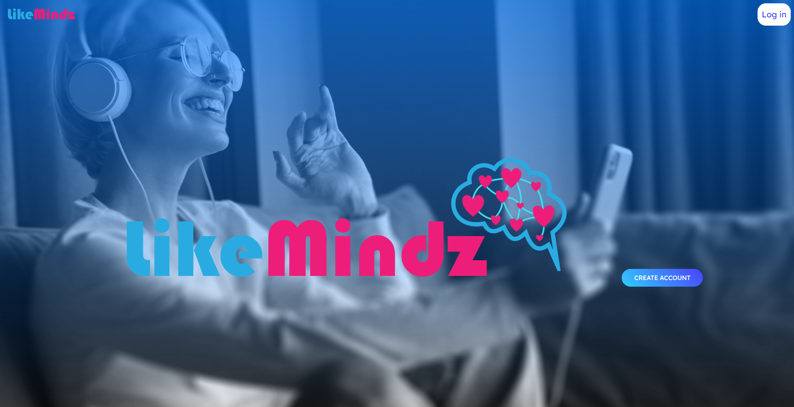

<Like-Mindz>

## Description

We have created an app that asks users to create an account and sign in. Once the user has signed in they are prompted with a onboarding screen that takes a users information and then once they submit the answers they are presented with questions to hopefully match them with another user. Once matched the user will be brought to a chat room to talk to the matched users. We wanted to create this app to match college students who are attending a College to be able to find other College students who they could potentially be friends with and create a better college atmosphere.

## Table of Contents

- [Installation](#installation)
- [Usage](#usage)
- [Credits](#credits)
- [License](#license)

## Installation

You can install the app by running npm init -y to create a node app. Then run npx create-react-app to create a react application. Run npm i to install all the node modules and then run npm start to start the server and client with localhost.

## Usage

The deployed application is linked [here!](https://evening-scrubland-87400.herokuapp.com/)

## Credits

This project was collaborated between Grant Whitney, Derek Kilgore, Sevrin Eldred, Dakota Jones

## License

MIT License

Copyright (c) [2022] [KU-Coding-Bootcamp]

Permission is hereby granted, free of charge, to any person obtaining a copy
of this software and associated documentation files (the "Software"), to deal
in the Software without restriction, including without limitation the rights
to use, copy, modify, merge, publish, distribute, sublicense, and/or sell
copies of the Software, and to permit persons to whom the Software is
furnished to do so, subject to the following conditions:

The above copyright notice and this permission notice shall be included in all
copies or substantial portions of the Software.

THE SOFTWARE IS PROVIDED "AS IS", WITHOUT WARRANTY OF ANY KIND, EXPRESS OR
IMPLIED, INCLUDING BUT NOT LIMITED TO THE WARRANTIES OF MERCHANTABILITY,
FITNESS FOR A PARTICULAR PURPOSE AND NONINFRINGEMENT. IN NO EVENT SHALL THE
AUTHORS OR COPYRIGHT HOLDERS BE LIABLE FOR ANY CLAIM, DAMAGES OR OTHER
LIABILITY, WHETHER IN AN ACTION OF CONTRACT, TORT OR OTHERWISE, ARISING FROM,
OUT OF OR IN CONNECTION WITH THE SOFTWARE OR THE USE OR OTHER DEALINGS IN THE
SOFTWARE.

## Badges

N/A

## Features

N/A

## How to Contribute

You can contribute to this project by forking the code in the repository.

## Tests

This app currently does not have any tests
